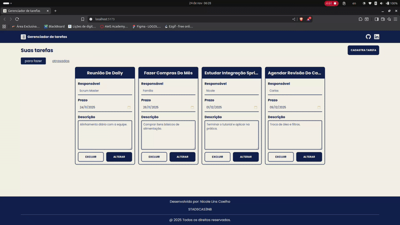
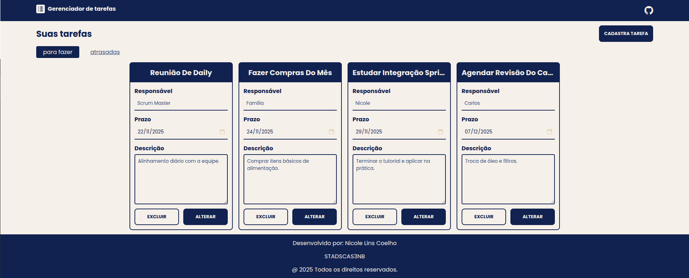
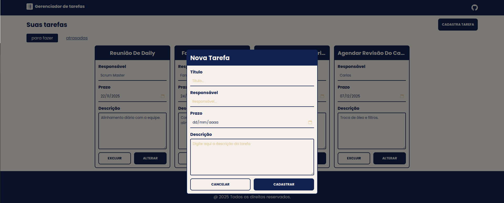
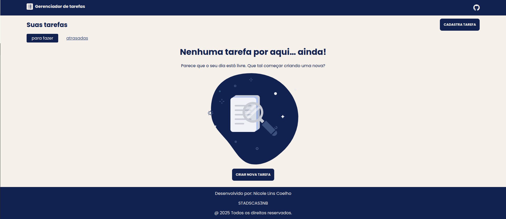
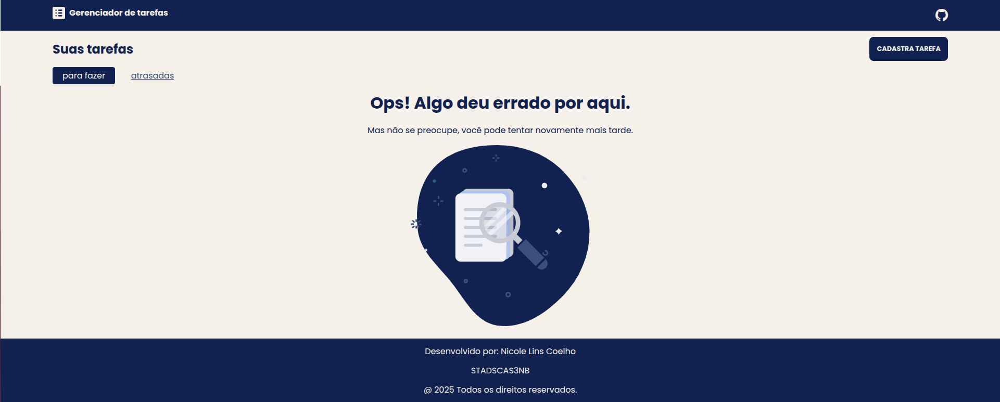
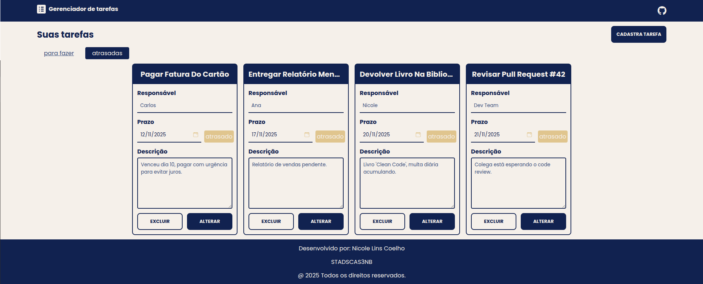

# 📝 Gerenciador de Tarefas

<div align="center">
  
  
  
</div>

Aplicação web para gerenciamento de tarefas diárias, desenvolvida com **React** e **TypeScript**. O projeto foca em uma experiência de usuário fluida, permitindo criar, editar, excluir e filtrar tarefas entre "Para Fazer" e "Atrasadas" automaticamente.

Este projeto consome uma API REST desenvolvida em Java/Spring Boot.

## 🚀 Tecnologias Utilizadas

* **React** (Vite)
* **TypeScript**
* **TanStack Query (React Query)** - Gerenciamento de estado assíncrono e cache.
* **Axios** - Requisições HTTP.
* **CSS Modules** - Estilização escopada por componente.
* **Bootstrap Icons** - Ícones da interface.

---

## ⚠️ Pré-requisitos (Backend)

Este projeto é o **Frontend**. Para que ele funcione corretamente e exiba os dados, você **precisa** ter o Backend rodando localmente.

1.  Acesse o repositório do Backend: https://github.com/Elociny/tasks.git
2.  Siga as instruções para rodar a API Spring Boot.
3.  Certifique-se de que a API está rodando na porta `8080` (padrão).

---

## 📦 Como rodar o Frontend

Certifique-se de ter o [Node.js](https://nodejs.org/) instalado em sua máquina.

1.  **Clone este repositório:**
    ```bash
    git clone https://github.com/Elociny/to-do-list.git
    cd to-do-list
    ```

2.  **Instale as dependências:**
    ```bash
    npm install
    ```

3.  **Rode o projeto:**
    ```bash
    npm run dev
    ```

4.  Acesse no seu navegador 
    ```bash
    http://localhost:5173
    ```

---

## ✨ Funcionalidades

* **Listagem Inteligente:** Separação automática de tarefas "Para Fazer" (Futuras/Hoje) e "Atrasadas" (Passadas).
* **CRUD Completo:**
    * ✅ Criar nova tarefa.
    * 👀 Visualizar detalhes.
    * ✏️ Editar tarefa existente.
    * 🗑️ Excluir tarefa.
* **Feedback Visual:**
    * Indicadores automáticos de "Atrasado" nos formulários.
    * Componentes de **Loading** enquanto os dados carregam.
    * Tratamento de **Erros** (caso o backend esteja desligado).
    * Tela de **Empty State** (quando não há tarefas cadastradas).

---

## 📂 Estrutura do Projeto

O projeto segue uma arquitetura organizada por funcionalidades e componentes reutilizáveis:

```text
src/
├── components/       # Botões, Inputs, Modais e Layouts
├── hooks/            # Custom Hooks (useTarefas com React Query)
├── pages/            # Páginas da aplicação
├── types/            # Interfaces TypeScript
├── api/              # Configuração do Axios
└── App.tsx           # Componente Raiz
```

---

## 📸 Galeria de Telas

Aqui estão os diferentes estados da aplicação:

| 🏠 Home (Com Tarefas) | 📝 Modal de Criação/Edição |
|:---:|:---:|
|  |  |

| 🏜️ Estado Vazio | ⚠️ Estado de Erro |
|:---:|:---:|
|  |  |

| 📅 Filtro: Para Fazer | 📅 Filtro: Atrasadas |
|:---:|:---:|
|  |  |
